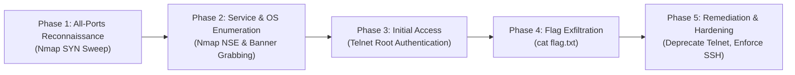

# HackTheBox — Meow (Starting Point)

**Target IP:** `10.129.130.138`  
**Difficulty:** Very Easy  
**Tier:** Tier 0 (Starting Point)  
**Operating System:** Linux (Ubuntu)  
**Vulnerability / Service:** Insecure Legacy Remote Access (Telnet / Linux telnetd) — Blank / Unauthenticated Root Password  

---

## 1. Executive Summary & Objective

**Meow** is the introductory machine in the HackTheBox Starting Point series (Tier 0). It is designed to familiarize security practitioners with fundamental penetration testing concepts, including full-port TCP scanning, service identification, and connecting to legacy remote management protocols.

The primary objective is to discover open ports across the target host, identify the running service, exploit an insecurely configured administrative account (`root`) with a blank password over the unencrypted Telnet protocol, and capture the proof flag stored in `flag.txt`.

---

## 2. Methodology Overview

The assessment follows a structured penetration testing workflow:



1. **All-Ports Reconnaissance:** Performing a rapid SYN scan across the entire TCP port range (1–65535).
2. **Service & Version Enumeration:** Probing the identified open port with Nmap Scripting Engine (NSE) scripts and OS detection.
3. **Initial Exploitation:** Connecting via Telnet using default administrative credentials without a password.
4. **Post-Exploitation & Flag Capture:** Locating and reading `flag.txt` directly from the root user's home directory.
5. **Remediation & Hardening:** Outlining best practices to secure remote administrative access in production environments.

---

## 3. Phase 1: Reconnaissance (All-Ports TCP Scan)

To ensure no non-standard or high-range ports are missed, we begin with a full-port SYN stealth scan:

```bash
sudo nmap -sS -p- --min-rate 2000 -Pn -n -v $TARGET -oN allports.nmap
```

### Command Flags Breakdown:
- `sudo`: Executes Nmap with elevated privileges, necessary for crafting raw TCP SYN packets.
- `-sS`: Performs a TCP SYN (Stealth / Half-Open) scan. Nmap sends SYN packets and inspects responses (SYN/ACK or RST) without establishing a full three-way handshake, reducing overhead and evasion footprints.
- `-p-`: Scans all 65,535 TCP ports (`1-65535`).
- `--min-rate 2000`: Mandates that Nmap sends at least 2,000 packets per second, drastically accelerating the full-range port sweep over network latency.
- `-Pn`: Skips ICMP ping discovery, treating the target host as actively online.
- `-n`: Disables reverse DNS resolution to eliminate unnecessary network queries.
- `-v`: Enables verbose output, reporting newly discovered open ports to the terminal immediately upon discovery.
- `-oN allports.nmap`: Saves the scan output in standard human-readable format to `allports.nmap`.

### Scan Result:


### Key Finding:
- **Port 23/TCP:** `open` — `telnet`
- All other 65,534 TCP ports returned closed (`reset`).

---

## 4. Phase 2: Service & OS Enumeration

With port 23 confirmed open, we conduct a targeted service and operating system enumeration scan against that specific port.

```bash
sudo nmap -sC -sV -O -p 23 -Pn -n -v $TARGET -oA service.nmap
```

### Command Flags Breakdown:
- `-sC`: Runs default Nmap NSE scripts to detect service banners, common vulnerabilities, and system information.
- `-sV`: Probes the open port to determine the specific service name and daemon version.
- `-O`: Enables OS detection using TCP/IP stack fingerprinting.
- `-p 23`: Targets port 23 exclusively to maximize speed and detail.
- `-oA service.nmap`: Exports scan output in three standard formats (`.nmap`, `.gnmap`, and `.xml`).

### Scan Result:


### Key Findings from Output:
```text
PORT   STATE SERVICE VERSION
23/tcp open  telnet  Linux telnetd
Device type: general purpose
Running: Linux 4.X|5.X
OS details: Linux 4.15 - 5.19
Service Info: OS: Linux; CPE: cpe:/o:linux:linux_kernel
```

- **Service:** Telnet
- **Daemon:** `Linux telnetd`
- **Operating System:** Linux (Kernel versions 4.15 – 5.19 / Ubuntu)

---

## 5. Phase 3: Exploitation (Telnet Root Authentication)

### Protocol Background & Risk:
**Telnet** is an obsolete network protocol dating back to 1969. Unlike modern protocols like SSH, Telnet transmits all data—including usernames, passwords, and commands—in **unencrypted plaintext** over the wire.

Furthermore, many misconfigured embedded systems, IoT devices, or legacy Linux setups retain default administrative credentials, or omit passwords on critical accounts altogether.

### Connecting to the Target:
We initiate a connection to the target host using the standard native `telnet` client:

```bash
telnet 10.129.130.138
```

### Interactive Authentication Flow:
1. Upon connecting, the server prompts for user credentials:
   ```text
   Meow login: root
   ```
2. No password challenge is presented (or pressing `Enter` with a blank password is accepted).
3. The server authenticates the session immediately and presents the Ubuntu system banner (MOTD) along with an interactive root prompt:
   ```text
   root@Meow:~#
   ```

---

## 6. Phase 4: Post-Exploitation & Flag Exfiltration

Having obtained an unrestricted root shell, we inspect the current directory and read the challenge flag:

1. **Inspect Directory Contents:**
   ```bash
   root@Meow:~# ls
   flag.txt  snap
   ```

2. **Display the Flag:**
   ```bash
   root@Meow:~# cat flag.txt
   ```


The machine is fully compromised with highest-privilege access achieved immediately on initial entry.

---

## 7. Remediation & Hardening Guidelines

Leaving Telnet active with an unauthenticated administrative account represents a critical security failure. To remediate this issue on Linux systems:

1. **Deprecate and Disable Telnet:**
   Stop and disable the `telnetd` service immediately:
   ```bash
   sudo systemctl stop inetd
   sudo systemctl disable inetd
   sudo apt purge telnetd
   ```

2. **Migrate to SSH (Secure Shell):**
   Install and configure OpenSSH server to provide encrypted remote administration:
   ```bash
   sudo apt install openssh-server
   sudo systemctl enable --now ssh
   ```

3. **Disallow Blank Passwords & Disable Direct Root Login:**
   - Enforce a robust password policy:
     ```bash
     sudo passwd root
     ```
   - In `/etc/ssh/sshd_config`, prevent direct root login and mandate key-based authentication:
     ```ini
     PermitRootLogin no
     PasswordAuthentication no
     PubkeyAuthentication yes
     ```

4. **Firewall & Access Control:**
   Use host-based firewalls (`ufw` or `iptables`) to block port 23 and restrict SSH (port 22) access to designated management networks or VPN IP addresses only.
